# 🛒 Lista de Compras - TCC

Projeto de TCC de um aplicativo de Lista de Compras desenvolvido em Flutter com Firebase. O aplicativo é uma solução completa e moderna para gerenciamento de compras, com foco em organização, colaboração em tempo real e controle financeiro.

**Status:** ✅ Concluído

Todos os requisitos funcionais e não funcionais propostos foram implementados com sucesso. O projeto foi finalizado e entregue na data prevista (20/11/2025).

## Índice

- [✨ Funcionalidades Principais](#-funcionalidades-principais)
- [🛠️ Tecnologias Utilizadas](#️-tecnologias-utilizadas)
- [🏗️ Arquitetura](#️-arquitetura)
- [🚀 Como Executar o Projeto](#-como-executar-o-projeto)
- [📚 Documentação Detalhada](#-documentação-detalhada)

## ✨ Funcionalidades Principais

O aplicativo está funcionalmente completo e inclui os seguintes recursos:

- **Autenticação de Usuário:** Sistema completo de cadastro, login e logout com Firebase Authentication.
- **Dashboard Informativo:** A tela inicial apresenta um resumo com as próximas compras, total de gastos no mês, gráfico de despesas por categoria e detalhes da última compra.
- **Gerenciamento de Listas:**
  - Crie, edite e delete listas de compras ativas.
  - Adicione nome, categoria e data de compra.
- **Gerenciamento de Itens:**
  - Adicione produtos a uma lista a partir de um catálogo global.
  - Marque itens como comprados, edite preços e quantidades em tempo real.
- **Colaboração em Tempo Real:**
  - Compartilhe listas com outros usuários através do e-mail.
  - Defina permissões de acesso (`editor` ou `visualizador`).
- **Histórico de Compras:**
  - Listas finalizadas são movidas automaticamente para uma tela de histórico.
  - Clone listas antigas para reutilizá-las em novas compras.
- **Análise de Gastos:**
  - Visualize um relatório de despesas com filtros por período.
  - Um gráfico de pizza mostra a distribuição dos gastos por categoria.
- **Catálogo de Produtos:** Uma base de produtos que pode ser expandida pelos usuários.

## 🖼️ Telas do Aplicativo

A seguir, algumas das principais telas que representam o fluxo de uso do aplicativo.

### Autenticação e Onboarding

| Login | Criar Conta | Recuperar Senha |
| :---: | :---: | :---: |
| 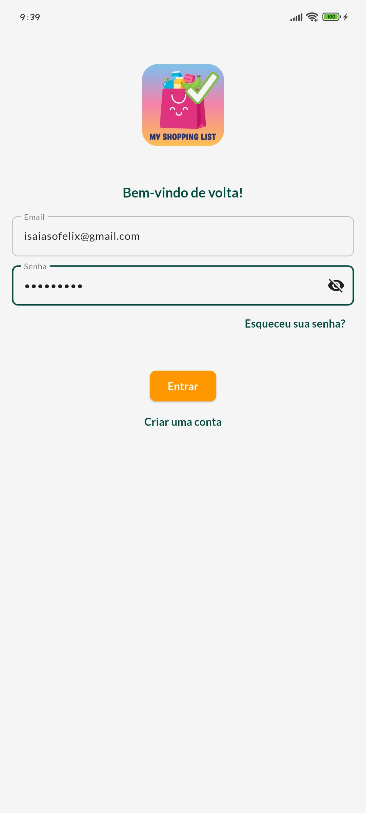 | 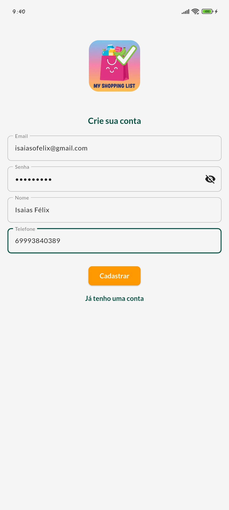 | 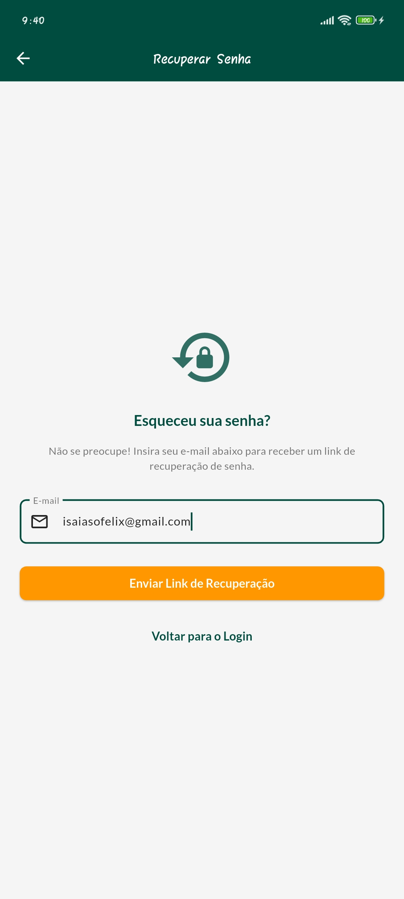 |

### Home, Dashboard e Navegação

| Home (Sem Listas) | Home (Com Listas) | Menu Lateral |
| :---: | :---: | :---: |
| 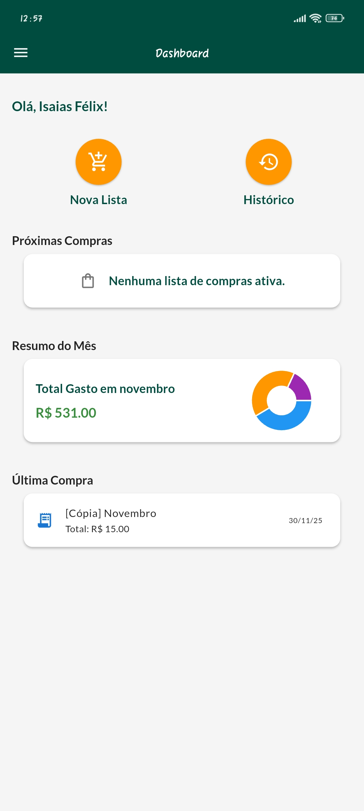 | 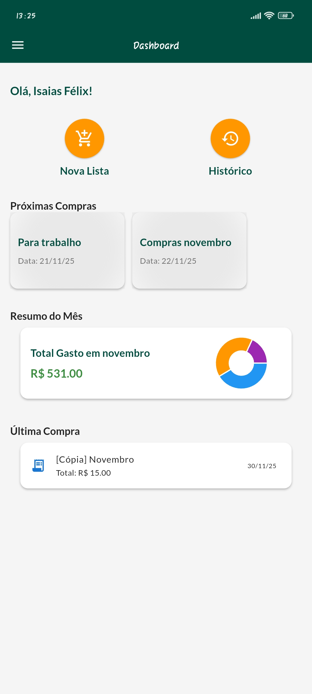 | 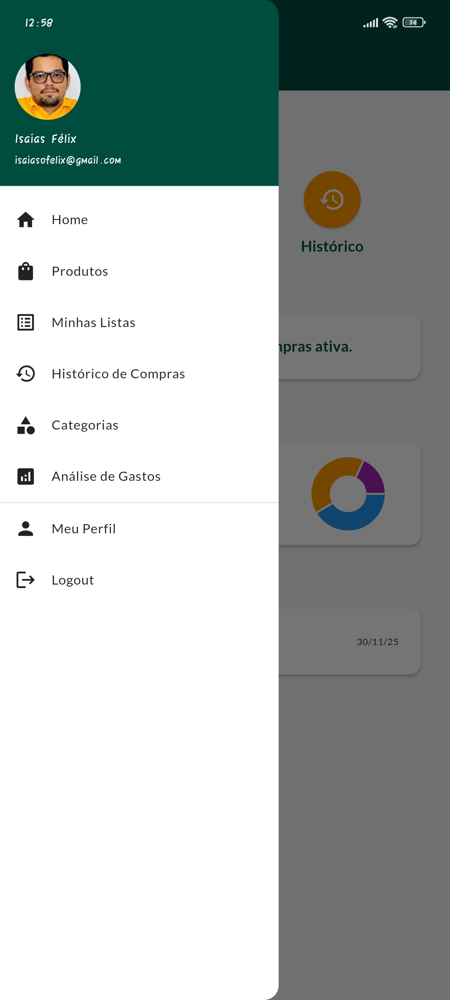 |

### Gerenciamento de Listas de Compras

| Listas Ativas | Criando uma Lista | Dentro da Lista | Gerenciando Membros |
| :---: | :---: | :---: | :---: |
| 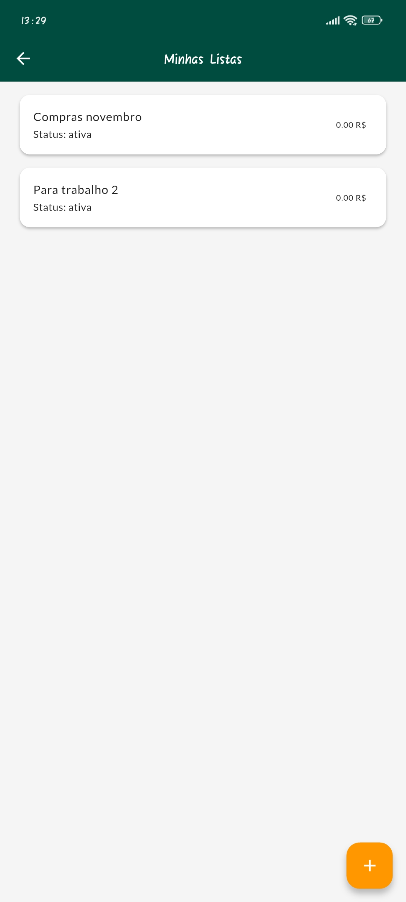 | 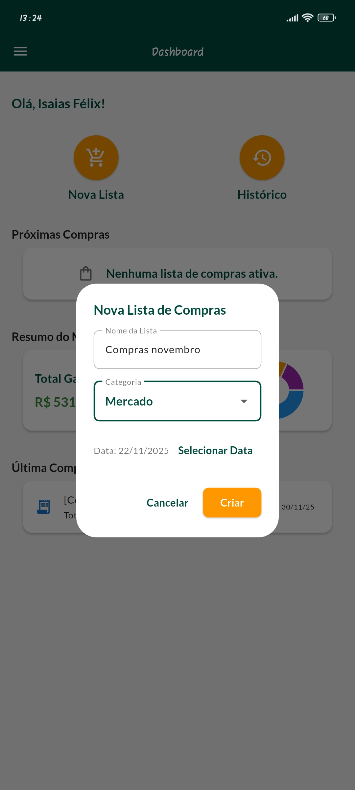 | 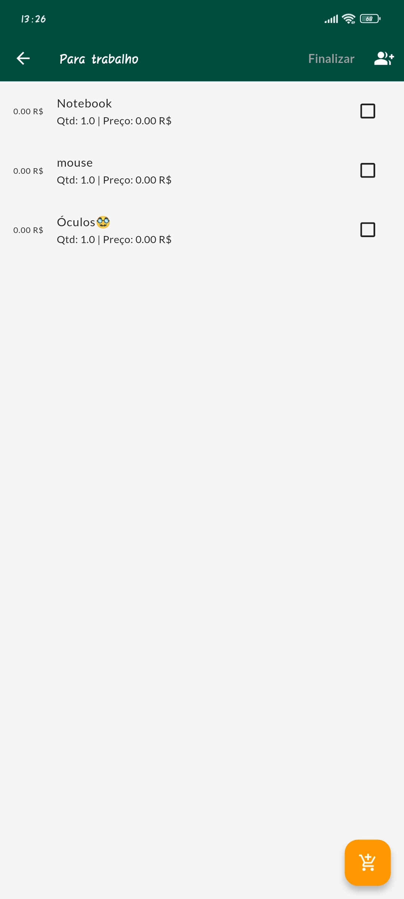 | 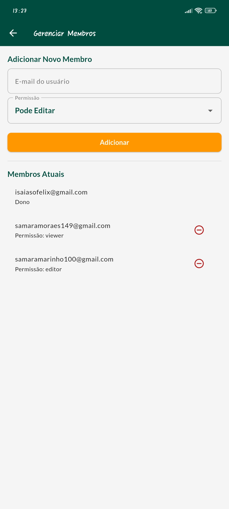 |

### Catálogo de Produtos e Categorias

| Produtos | Cadastrando Produto | Selecionando Produto | Categorias | Cadastrando Categoria |
| :---: | :---: | :---: | :---: | :---: |
| 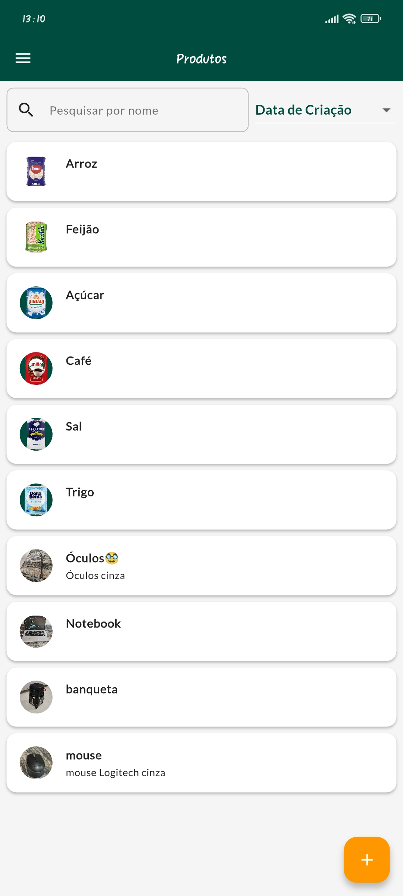 |  | 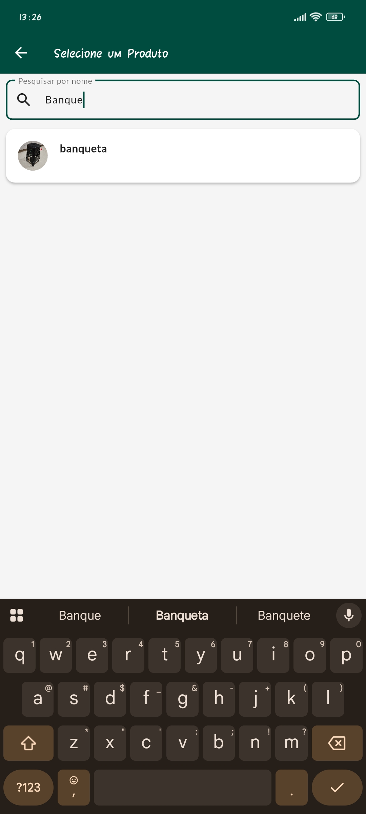 | 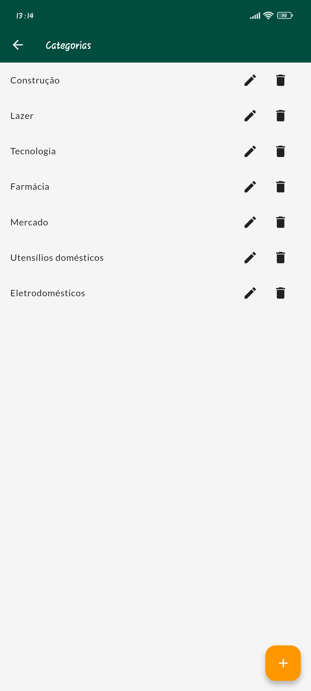 | 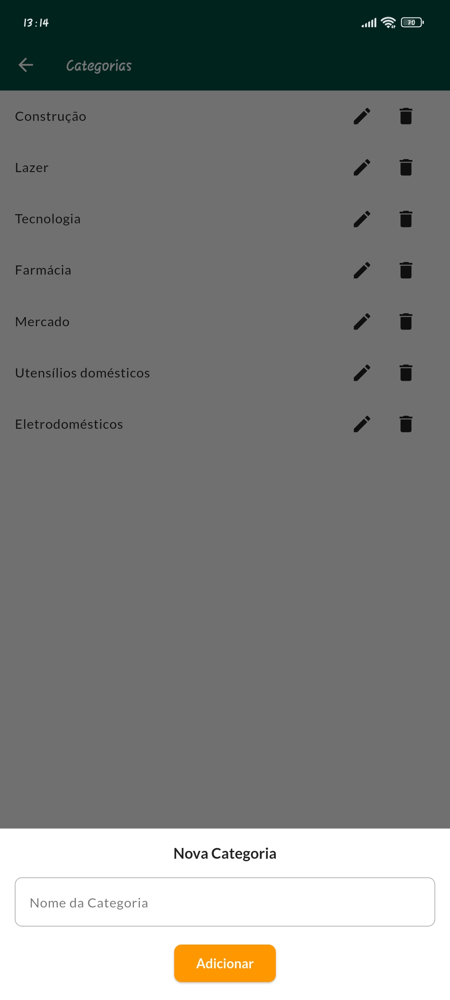 |

### Histórico e Análise de Gastos

| Histórico de Listas | Análise de Gastos |
| :---: | :---: |
| 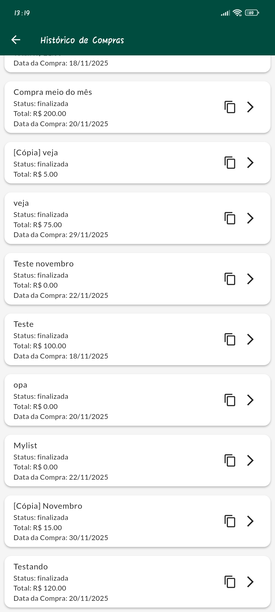 | 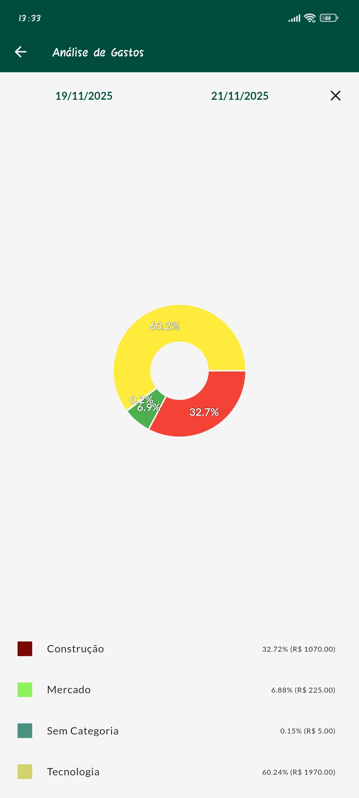 |

## 🛠️ Tecnologias Utilizadas

- **Framework:** [Flutter](https://flutter.dev/)
- **Linguagem:** [Dart](https://dart.dev/)
- **Backend:** [Firebase](https://firebase.google.com/)
  - **Autenticação:** Firebase Authentication
  - **Banco de Dados:** Cloud Firestore
  - **Armazenamento:** Firebase Storage (para imagens de produtos)
- **Gerenciamento de Estado:** [GetX](https://pub.dev/packages/get)
- **Gráficos:** [fl_chart](https://pub.dev/packages/fl_chart)
- **Internacionalização de Datas:** [intl](https://pub.dev/packages/intl)

## 🏗️ Arquitetura

O projeto foi desenvolvido seguindo boas práticas de engenharia de software, com uma arquitetura limpa e escalável:

- **MVVM (Model-View-ViewModel):** Utilizando os `Controllers` do GetX como ViewModels.
- **Repository Pattern:** Uma camada de repositório (`lib/app/data/repositories`) foi implementada para abstrair e centralizar toda a comunicação com o Firebase, desacoplando a lógica de negócios da fonte de dados.
- **Injeção de Dependências:** O GetX Bindings (`InitialBinding`) é utilizado para gerenciar o ciclo de vida e a injeção de todas as dependências globais (Controllers e Repositories) de forma centralizada.

## 🚀 Como Executar o Projeto

### Pré-requisitos

1.  **Flutter:** Certifique-se de ter o Flutter instalado. Para mais informações, veja a [documentação oficial](https://flutter.dev/docs/get-started/install).
2.  **Firebase:** Você precisará de um projeto Firebase.
    - Crie um projeto no [console do Firebase](https://console.firebase.google.com/).
    - Configure seu projeto para Android, iOS ou Web.
    - Baixe o arquivo de configuração `google-services.json` (para Android) e coloque-o em `android/app/`.
    - Certifique-se de habilitar **Authentication** (com provedor de E-mail/Senha), **Cloud Firestore** e **Firebase Storage**.

### Instalação e Execução

1.  **Clone o repositório:**
    ```sh
    git clone <URL_DO_REPOSITORIO>
    cd lista_compras
    ```

2.  **Instale as dependências:**
    ```sh
    flutter pub get
    ```

3.  **Execute o aplicativo:**
    ```sh
    flutter run
    ```

## 📚 Documentação Detalhada

Toda a documentação do projeto, incluindo visão geral, requisitos, fluxo de usuário, memorial técnico e histórico de desenvolvimento, está organizada na pasta [`Docs/`](./Docs).

Abaixo está um guia para os documentos disponíveis:

- **`01_VISAO_GERAL.md`**: Descreve o objetivo do produto e o público-alvo.
- **`02_HISTORICO_DESENVOLVIMENTO.md`**: Contém o plano do projeto e um diário detalhado de todo o progresso.
- **`03_REQUISITOS_E_CASOS_DE_USO.md`**: Detalha os requisitos funcionais, não funcionais e a estrutura de dados no Firestore.
- **`04_FLUXO_DE_USUARIO.md`**: Mapeia a jornada do usuário através das telas do aplicativo.
- **`05_MEMORIAL_TECNICO.md`**: Explica a arquitetura, as decisões técnicas e as tecnologias utilizadas.
- **`06_RELATORIO_FINAL.md`**: Apresenta a análise conclusiva sobre o projeto, sua arquitetura e a qualidade do produto final.